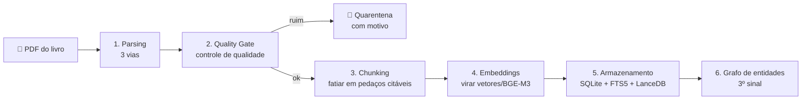
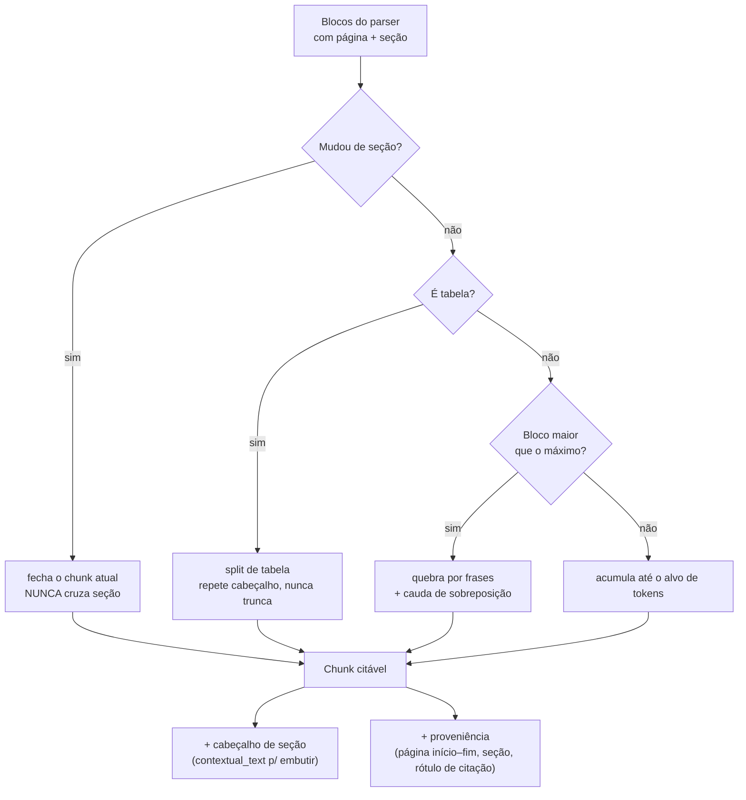
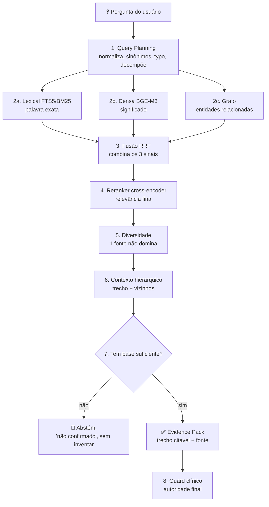
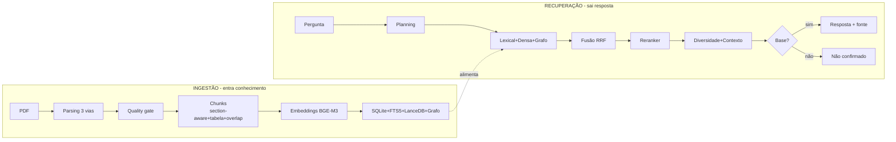

# Como funciona o nosso RAG — explicação didática

> Documento para entender, sem precisar ser especialista, **como o appPOCUS transforma
> livros e diretrizes de medicina em respostas confiáveis e com fonte**. Primeiro o
> caminho de **entrada** do conhecimento (ingestão), depois o caminho de **saída**
> (recuperação da informação quando alguém pergunta algo).

---

## 0. A ideia em uma frase

> **RAG = Retrieval-Augmented Generation** (Geração Aumentada por Recuperação).
> Em vez de a IA "inventar de cabeça", ela primeiro **procura o trecho certo** na nossa
> biblioteca médica curada e só então **responde citando a fonte**. Se não achar base, ela
> **avisa** em vez de chutar.

Pense numa **bibliotecária de plantão numa UTI**:
1. Ela **cataloga** os livros quando chegam (ingestão).
2. Quando um médico pergunta algo, ela **corre até a estante certa**, acha a **página exata**, e entrega **com a referência** (recuperação).
3. Se ela não tem a fonte, ela diz "não tenho isso confirmado" — não inventa uma dose.

O nosso sistema faz exatamente isso, de forma automática e determinística.

---

# PARTE 1 — O PIPELINE DE INGESTÃO (colocar conhecimento pra dentro)

O objetivo da ingestão é pegar um PDF bruto e transformá-lo em **pedaços pequenos,
limpos, com endereço (página/seção) e prontos para busca**.

---

## 1. Parsing — ler o PDF (as 3 vias)

Um PDF pode ser de três "durezas". Por isso temos **três leitores** (parsers), e um
**roteador** escolhe o melhor para cada documento automaticamente:

| Via | Para que serve | Analogia |
|-----|----------------|----------|
| **pdftotext** | Fallback simples e rápido. Sempre funciona. | Fotocopiadora básica |
| **liteparse** | PDFs **digitais** (texto de verdade embutido). Rápido, reconstrói tabelas em Markdown. | Escâner bom com OCR embutido |
| **MinerU** | PDFs **escaneados/complexos** (imagem, colunas, tabelas de dose). Usa OCR + IA de layout. | Escâner profissional que "entende" a página |

**Como o roteador decide** (`parsing/router.py` + `base.py`): ele mede a "densidade de
texto" e o layout. Documento digital simples → **liteparse**. Documento escaneado/denso →
**MinerU**. Se o parser pesado falhar, ele **cai graciosamente** para o pdftotext — e agora
isso fica **visível no status** (`degraded_parser`), pra ninguém achar que teve MinerU
quando não teve.

**Por que isso melhora o resultado:** um livro de UTI escaneado tem **tabelas de dose**.
Se lêssemos com um parser fraco, a tabela viraria texto embaralhado e a dose sairia errada.
O MinerU **preserva a tabela** (validamos: ele extraiu uma tabela de titulação de
nitroglicerina inteira, com PAS, bolus e mcg/min corretos).

---

## 2. Quality Gate — barrar lixo antes de virar fonte

Nem todo PDF vira conhecimento. Antes de fatiar, passamos por um **porteiro de qualidade**
(`quality.py`). Se o documento for:
- **sem texto extraível** (`no_extractable_text`) — ex.: só imagem, OCR falhou;
- **texto corrompido** (`garbled_text`) — cheio de caracteres quebrados;
- **muito curto** (`too_few_words`, opcional/configurável),

ele vai para a **quarentena** com um **motivo (reason code)** e **não gera nenhum chunk**.
Um documento em quarentena **nunca aparece na busca** — é impossível citá-lo.

**Por que isso melhora o resultado:** garante que a IA só cite material legível e íntegro.
"Lixo entra, lixo sai" — o gate impede o lixo de entrar.

---

## 3. Chunking — o coração do RAG (fatiar em pedaços citáveis)

> Esta é a parte que você pediu em detalhe. É onde se ganha ou se perde qualidade.

### 3.1 Por que fatiar?

Um livro tem 1.700 páginas. A IA não "lê o livro inteiro" para responder — seria caro,
lento e ela se perderia. Em vez disso, dividimos o livro em **pedaços pequenos e
autossuficientes** (os *chunks*). Cada chunk é um "cartão de fichário": um trecho que, lido
sozinho, faz sentido e pode ser **citado**.

- **Chunk pequeno demais** → perde contexto ("aumentar a dose" — de quê? quanto?).
- **Chunk grande demais** → vira "palheiro": a IA acha o chunk certo mas o trecho relevante fica diluído no meio de coisa irrelevante, e a busca semântica perde precisão.

O jogo é achar o **tamanho e a fronteira certos**.

### 3.2 As possibilidades (o "cardápio" de estratégias de chunking)

Existem várias formas de fatiar. Da mais ingênua à mais sofisticada:

| Estratégia | Como funciona | Prós | Contras |
|-----------|---------------|------|---------|
| **Tamanho fixo** (fixed-size) | Corta a cada N caracteres/tokens, "na régua". | Simples, rápido. | Corta no meio de frases e tabelas. Péssimo para clínica. |
| **Por frase/parágrafo** | Quebra em sentenças ou parágrafos. | Respeita a língua. | Frases soltas perdem contexto; parágrafos variam muito de tamanho. |
| **Recursivo** (recursive) | Tenta quebrar por seção → parágrafo → frase → palavra, nessa ordem, até caber. | Bom equilíbrio. | Não entende tabelas nem semântica. |
| **Semântico** (semantic) | Usa embeddings para cortar onde o "assunto muda". | Fronteiras naturais. | Caro (precisa embutir tudo antes de cortar) e não determinístico. |
| **Janela deslizante c/ sobreposição** (sliding window + overlap) | Pedaços que se sobrepõem um pouco nas bordas. | Não perde info que ficou "na emenda". | Duplica um pouco de texto. |
| **Consciente de seção / hierárquico** (section-aware) | Nunca cruza a fronteira de uma seção; carrega o cabeçalho da seção junto. | Cada chunk sabe "de onde é". Ótimo para citar. | Precisa de um parser que identifique seções. |
| **Consciente de tabela** (table-aware) | Trata tabelas de forma especial (repete cabeçalho, nunca trunca). | Preserva doses/valores. | Precisa detectar tabelas (MinerU). |
| **Contextual / pai-filho** (parent-child, contextual retrieval) | Busca no filho pequeno, mas entrega o pai maior (ou um cabeçalho de contexto). | Precisão da busca + contexto da resposta. | Mais complexo de armazenar. |
| **Late chunking** | Embute o documento inteiro e só depois corta os vetores. | Contexto global no vetor. | Exige modelo/infra específicos; caro. |

### 3.3 O que **nós** fazemos (e por quê) — `chunking.py`

Nós combinamos as **melhores** dessas ideias, numa estratégia **híbrida, determinística e
com proveniência**:

Concretamente, cada chunk nosso tem **5 propriedades** que melhoram o resultado:

1. **Section-aware (nunca cruza seção).** Se o texto passa de "Tratamento" para
   "Complicações", fechamos o chunk. Assim um chunk nunca mistura dois assuntos. → *busca
   mais precisa e citação honesta.*
2. **Alvo de tamanho com folga** (config `RAG_CHUNK_MIN=350`, `RAG_CHUNK_MAX=700` tokens).
   Nem migalha, nem palheiro. Acumulamos blocos até ~350–700 "palavras". → *equilíbrio
   contexto × precisão.*
3. **Sobreposição** (`RAG_CHUNK_OVERLAP=90` tokens). Cada chunk leva uma "cauda" do anterior.
   Assim, se a informação caiu bem na emenda entre dois chunks, ela não se perde. → *recall.*
4. **Tabela intacta** (`_split_table`). Tabela grande é dividida **por linhas, repetindo o
   cabeçalho**, e **nunca trunca** uma linha (uma linha gigante sai inteira). Tabela de dose
   nunca perde uma linha. → *segurança clínica.*
5. **Cabeçalho contextual + proveniência.** Guardamos duas versões: o **texto do trecho**
   (o que será citado) e um **texto contextual** = "seção + trecho" (o que vira o vetor de
   busca). E cada chunk carrega **página início–fim, caminho da seção e um rótulo de
   citação**. → *a IA cita "livro X, p. 123, seção Sepse > Tratamento".*

### 3.4 A **melhor** escolha para o **nosso** projeto (clínico)

Por que a nossa combinação é a certa para medicina de urgência/UTI:

- **Section-aware + tabela intacta** são **inegociáveis** aqui: o pior erro possível é
  misturar a dose de um remédio com o texto de outro, ou truncar uma linha de tabela de
  dose. Estratégias "na régua" (fixed-size) fariam exatamente isso.
- **Sobreposição** ajuda porque diretrizes têm frases-chave ("máximo 800 mcg/min") que
  costumam cair em bordas.
- **Determinístico** (sem IA no corte) porque queremos **reproduzir** o mesmo chunk sempre —
  auditável, sem alucinação no próprio processo de fatiar.
- **Cabeçalho contextual no vetor** = o embedding "sabe" que aquele trecho é de "Sepse >
  Antibioticoterapia", melhorando a busca sem poluir a citação.

**Ajustes possíveis (knobs) que você pode calibrar sem mexer no código:**
`RAG_CHUNK_MIN`, `RAG_CHUNK_MAX`, `RAG_CHUNK_OVERLAP`. Recomendação atual (350/700/90) é um
bom ponto de partida; para diretrizes muito densas em tabelas, dá para reduzir o máximo;
para prosa longa, aumentar a sobreposição.

> **Evolução futura possível** (não implementada ainda): *contextual retrieval* pai-filho
> (buscar no filho, responder com o pai) e filtragem de páginas de referências
> bibliográficas (que hoje às vezes viram o "melhor chunk" e disparam abstenção). Ambas
> melhorariam a precisão; ficam como próximos passos.

---

## 4. Embeddings — transformar texto em "coordenadas de significado"

Cada chunk é convertido num **vetor** de 1.024 números pelo modelo **BGE-M3**
(`RAG_EMBED_DIM=1024`). Pense num **mapa gigante de significados**: textos que falam da
mesma coisa ficam **perto** nesse mapa, mesmo com palavras diferentes.

- "IAM", "infarto agudo do miocárdio" e "heart attack" caem **no mesmo bairro**.
- O BGE-M3 é **multilíngue** → uma pergunta em português acha conteúdo em inglês (validamos
  isso: pergunta PT recuperou diretriz EN).

**Por que melhora:** permite busca **por significado** (semântica), não só por palavra
exata. É o que faz o sistema achar a resposta mesmo quando o usuário escreve diferente do
livro.

---

## 5. Armazenamento — três "índices" que se complementam

Guardamos cada chunk em três lugares, porque cada um busca de um jeito:

| Índice | O que guarda | Como acha |
|--------|--------------|-----------|
| **SQLite (tabela `document_chunks`)** | O texto, a proveniência, o vetor | Verdade canônica; guarda tudo |
| **FTS5 (BM25)** | Índice de **palavras** | Busca **lexical** (palavra exata) |
| **LanceDB** (opcional) | Índice de **vetores** | Busca **densa** rápida (ANN) em escala |

---

## 6. Grafo de entidades — o 3º sinal (obrigatório)

Além de palavras e significado, construímos um **grafo** (`graph/store.py`): um mapa de
**entidades clínicas** (doenças, drogas — do léxico curado PT-BR) e de **quais chunks falam
de quais entidades**, com arestas de **co-ocorrência** e algumas **relações curadas**
(ex.: "noradrenalina —trata→ sepse").

- O grafo **só aponta IDs de chunk** — **nunca gera texto e nunca é citável**.
- Ele ajuda a puxar chunks **relacionados** que a busca por palavra/vetor sozinha perderia.

**Por que melhora:** aumenta o *recall* em consultas onde o vínculo é conceitual
(ex.: pergunto de uma droga e ele traz o chunk da doença que ela trata).

---

# PARTE 2 — O PIPELINE DE RECUPERAÇÃO (tirar a resposta certa)

Quando alguém pergunta algo, este é o caminho — **cada etapa filtra ou melhora** o
resultado até sobrar só o trecho certo, com fonte:

## 1. Query Planning — entender melhor a pergunta (`query_planning.py`)

Antes de buscar, "preparamos" a pergunta:
- **Normaliza acentos/caixa** ("Feocromocitoma" → "feocromocitoma").
- **Expande sinônimos/siglas/CID** usando o léxico ("IAM" → "infarto...", CID, termo em EN).
- **Tolera erro de digitação** (busca por 1 edição: "sepe" → "sepse").
- **Decompõe perguntas compostas** ("dose de X **e** como manejar Y" → duas subperguntas).

**Por que melhora:** aumenta o *recall* — acha a resposta mesmo com abreviação, acento
errado, sinônimo ou typo. (Validado: "fibrilacao atral" com typo ainda achou a diretriz.)

## 2. Três buscas em paralelo (os 3 sinais)

- **2a. Lexical (FTS5/BM25):** casa **palavra exata**. Ótima para siglas e termos técnicos.
- **2b. Densa (BGE-M3):** casa **significado**. Ótima para paráfrase, outra língua, typo.
- **2c. Grafo:** casa **entidades relacionadas**. É o **3º sinal obrigatório**.

Cada um sozinho erra em algum caso; **juntos se cobrem**. E todos respeitam o **filtro de
especialidade** (um agente "pediatria" nunca recebe chunk de "UTI adulto") e **escondem
documentos supersedidos** (diretriz vencida não domina a atual).

## 3. Fusão RRF — juntar os três rankings

O **Reciprocal Rank Fusion** combina as três listas numa só, premiando os chunks que
aparecem **bem colocados em mais de um sinal**. Garantia importante: o grafo é **aditivo** —
ele **nunca remove** um resultado que a busca lexical/densa já tinha achado (o grafo só
*acrescenta*).

## 4. Reranker (cross-encoder) — a peneira fina de relevância

Aqui entra o **modelo bge-reranker-v2-m3** (FlagReranker). Enquanto a busca é rápida e
"grosseira", o reranker **lê a pergunta e cada candidato juntos** e dá uma nota de
relevância precisa (0 a 1). **A relevância é o sinal primário** da resposta.

**Por que melhora (muito):** foi ele que, no teste, deu **0,99** para o trecho certo de
fibrilação atrial e **0,0002** para uma pergunta sem sentido — permitindo **abster** em vez
de citar lixo.

## 5. Diversidade — não deixar uma fonte dominar (`diversify`)

Limitamos quantos chunks do **mesmo documento** entram na resposta
(`RAG_DIVERSITY_FAMILY_CAP=3`) e removemos duplicatas exatas. Assim a resposta traz
**perspectivas de fontes diferentes**, não 8 pedaços do mesmo capítulo.

## 6. Contexto hierárquico — trecho + vizinhança (`_neighbor_context`)

Para cada trecho escolhido, anexamos os **chunks vizinhos** (mesmo doc, imediatamente antes
e depois) como **contexto de leitura** — claramente marcados como *contexto adicionado*,
**separados do trecho casado** (`is_matched_span`). O que é citável é o **trecho casado**;
a vizinhança só ajuda a ler.

## 7. Abstenção — o mais importante clinicamente

Se a melhor nota do reranker fica **abaixo do limiar** (`RAG_RERANK_MIN=0.3`) ou não há
chunks de apoio suficientes, o sistema **abstém**: entrega a resposta rotulada como
**"não confirmada pela Base de Conhecimento"**, **sem inventar** e **sem fabricar `[Fonte:]`**.

> **Regra de ouro do projeto:** melhor dizer "não tenho isso confirmado" do que dar uma dose
> sem fonte. (Validado: pergunta sem sentido → `abstain=True`, confiança 0,0002.)

## 8. Evidence Pack + Guard clínico

O resultado final é um **Evidence Pack**: a lista de trechos com **ID de fonte emitido pelo
servidor** (o modelo só pode citar IDs que o servidor entregou — não dá pra inventar
citação), rótulo, página, seção, contexto e as métricas.

Por cima de tudo, existe o **guard clínico determinístico** (fora deste repo, no gateway) —
a **autoridade final** que aplica a política de dose/alto-risco e o rótulo "não confirmada".

---

## Resumo visual — o caminho de ponta a ponta

## Onde cada peça mora (para quem quiser o código)

| Componente | Arquivo |
|-----------|---------|
| Roteador de parsers (3 vias) | `raggw/parsing/router.py`, `base.py` |
| Quality gate / quarentena | `raggw/quality.py` |
| Chunking (section-aware, tabela, overlap) | `raggw/chunking.py` |
| Embeddings (BGE-M3) | `raggw/embedding.py` |
| Armazenamento + FTS5 | `raggw/db.py`, `vectorstore.py` |
| Grafo de entidades | `raggw/graph/store.py`, `lexicon.py` |
| Planning de query | `raggw/query_planning.py` |
| Busca híbrida + fusão + rerank + diversidade + abstenção | `raggw/retrieval.py` |
| Reranker (FlagReranker/ONNX) | `raggw/reranking.py` |
| Filtro de fronteira compartilhado | `raggw/filters.py` |

---

### Parâmetros ajustáveis (as "maçanetas") — `.env`

| Variável | Padrão | O que faz |
|----------|--------|-----------|
| `RAG_CHUNK_MIN` / `RAG_CHUNK_MAX` | 350 / 700 | Tamanho-alvo do chunk (tokens) |
| `RAG_CHUNK_OVERLAP` | 90 | Sobreposição entre chunks |
| `RAG_EMBED_DIM` | 1024 | Dimensão do vetor BGE-M3 |
| `RAG_SEARCH_TOP_K` | 8 | Quantos trechos entram na resposta |
| `RAG_CANDIDATE_N` | 50 | Quantos candidatos vão ao reranker |
| `RAG_RERANK_MIN` | 0.3 | Nota mínima p/ não abster |
| `RAG_DIVERSITY_FAMILY_CAP` | 3 | Máx. de chunks por documento |
| `RAG_RERANKER` | flag | Reranker real (`flag` recomendado; `onnx` trava no torch atual) |

> Documento gerado a partir da validação end-to-end com modelos reais (BGE-M3 na GPU +
> FlagReranker + MinerU) em 2026-07-11. Reflete o código dos slices Super-RAG #318–#322.
